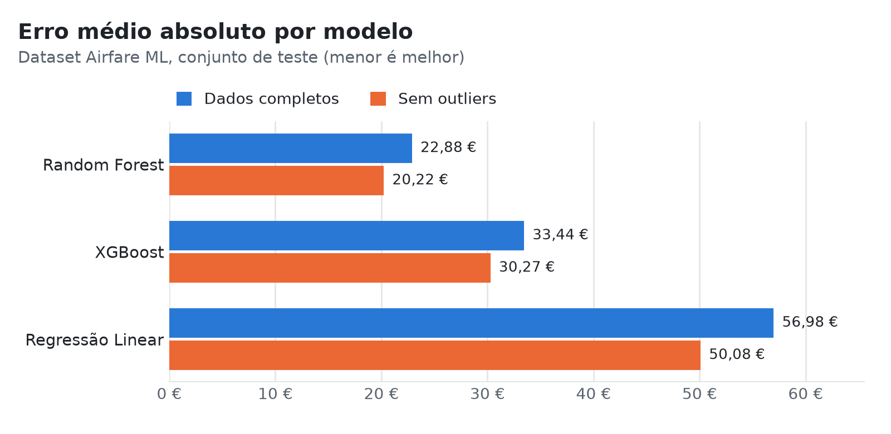
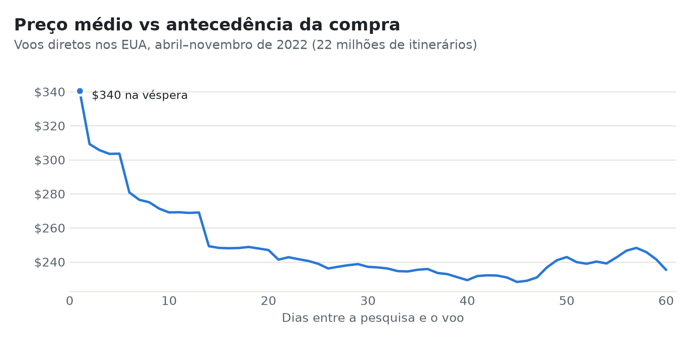
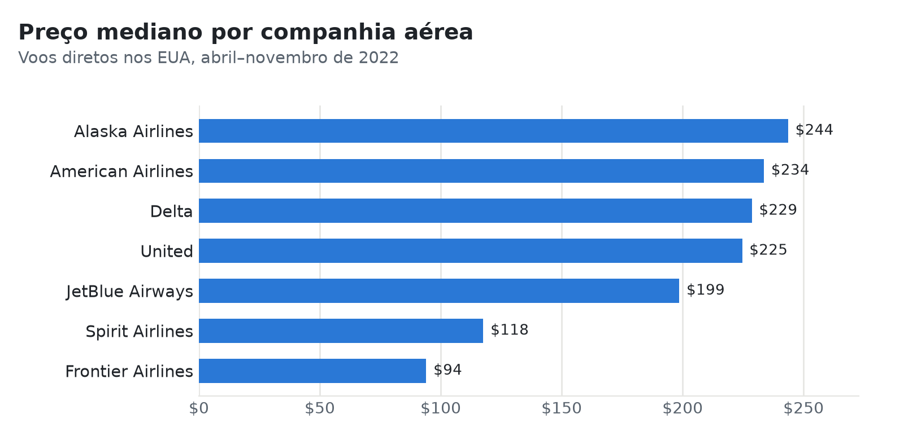

# Previsão de Preços de Voos


Previsão do preço de bilhetes de avião com Regressão Linear, Random Forest e XGBoost, a partir da rota, companhia
aérea, classe, horário e antecedência da compra. O trabalho usa dois datasets públicos do Kaggle: 82 milhões de
pesquisas de voos nos EUA (31 GB) e 450 mil voos domésticos na Índia.

<picture>
  <source media="(prefers-color-scheme: dark)" srcset="docs/img/resultados-dark.png">
  
</picture>

## Resultados

### Índia — [Airfare ML](https://www.kaggle.com/datasets/yashdharme36/airfare-ml-predicting-flight-fares)

Voos entre sete grandes cidades indianas, recolhidos no EaseMyTrip entre janeiro e março de 2023. Os preços foram
convertidos de rupias para euros. Teste com 20% dos dados.

| Modelo            | Cenário         | MAE (€)   | RMSE (€)  | R²        |
|-------------------|-----------------|----------:|----------:|----------:|
| Regressão Linear  | Dados completos |     56,98 |     86,36 |     0,853 |
| Random Forest     | Dados completos |     22,88 |     47,14 |     0,956 |
| XGBoost           | Dados completos |     33,44 |     56,59 |     0,937 |
| Regressão Linear  | Sem outliers    |     50,08 |     72,13 |     0,878 |
| **Random Forest** | Sem outliers    | **20,22** | **39,52** | **0,963** |
| XGBoost           | Sem outliers    |     30,27 |     48,11 |     0,946 |

No cenário "sem outliers" são removidos, pelo critério IQR, os voos com duração, antecedência ou preço fora do normal
antes da divisão treino/teste. As métricas desse cenário referem-se, por isso, apenas a voos dentro desses intervalos.

### EUA — [Flight Prices](https://www.kaggle.com/datasets/dilwong/flightprices)

22 milhões de voos diretos pesquisados no Expedia entre abril e outubro de 2022. Teste com 20% dos dados.

| Modelo            | MAE (USD) | RMSE (USD) | R²        |
|-------------------|----------:|-----------:|----------:|
| Regressão Linear  |     94,94 |     147,60 |     0,196 |
| **Random Forest** | **52,28** | **101,54** | **0,620** |
| XGBoost           |     61,63 |     109,67 |     0,556 |

Aqui o modelo só tem 8 features (aeroportos, companhia e datas). O dataset não inclui a hora de partida, a classe nem
os lugares disponíveis, que explicam boa parte do preço, por isso o R² fica bastante abaixo do obtido com os dados da
Índia.

## O que os dados mostram

<picture>
  <source media="(prefers-color-scheme: dark)" srcset="docs/img/antecedencia-dark.png">
  
</picture>

- Comprar na véspera custa em média $340; com mais de três semanas de antecedência, o preço médio fica perto de $240.
- A descida não é gradual: o preço cai em degraus por volta de uma, duas e três semanas antes do voo, o que coincide
  com as regras de compra antecipada das tarifas das companhias.

<picture>
  <source media="(prefers-color-scheme: dark)" srcset="docs/img/companhias-dark.png">
  
</picture>

- As low-cost (Frontier e Spirit) custam cerca de metade das companhias tradicionais, em preço mediano.
- Nos modelos de árvores treinados com estes dados, o aeroporto de destino é a feature mais importante, seguido da
  origem, da companhia e do mês do voo.

## Como funciona

1. **Filtragem** — `filter-itineraries` lê o CSV de 31 GB em streaming e filtra os voos diretos em paralelo, com
   `multiprocessing`, sem carregar o ficheiro em memória. Os 82 milhões de linhas são processados em cerca de 8 minutos.
2. **Análise exploratória** — distribuição de preços, companhias, rotas, antecedência e sazonalidade.
3. **Preparação** — features de data (antecedência, mês, dia da semana) e target encoding dos aeroportos e da
   companhia, ajustado apenas no conjunto de treino para não haver fuga de informação.
4. **Modelos** — Regressão Linear, Random Forest e XGBoost. No dataset da Índia o pré-processamento (one-hot encoding
   e normalização) faz parte de um `Pipeline` do scikit-learn.

## Estrutura

```
├── notebooks/
│   ├── 01_analise_exploratoria.ipynb   # EDA do dataset dos EUA
│   ├── 02_preparacao_dados.ipynb       # features, target encoding e normalização (EUA)
│   ├── 03_treino_dataset_eua.ipynb     # treino e avaliação com os dados dos EUA
│   └── 04_modelos_airfare.ipynb        # treino e avaliação com os dados da Índia
├── src/flight_prices/
│   ├── filter_itineraries.py           # filtragem paralela do CSV de 31 GB
│   ├── itineraries.py                  # carregamento e features do dataset dos EUA
│   ├── airfare.py                      # carregamento, outliers e pré-processamento do dataset da Índia
│   └── evaluation.py                   # treino, métricas e gráficos
└── docs/img/                           # figuras do README
```

## Como executar

```bash
git clone https://github.com/khomy86/ProjetoIA.git
cd ProjetoIA
python -m venv .venv
source .venv/bin/activate
pip install -e .
```

Descarregar os datasets do Kaggle para a pasta `data/`:

- `itineraries.csv` do [Flight Prices](https://www.kaggle.com/datasets/dilwong/flightprices) (5,5 GB comprimido)
- `Cleaned_dataset.csv` do [Airfare ML](https://www.kaggle.com/datasets/yashdharme36/airfare-ml-predicting-flight-fares)

Filtrar o dataset dos EUA e abrir os notebooks pela ordem:

```bash
filter-itineraries data/itineraries.csv data/voos_filtrados.csv
jupyter lab notebooks/
```

O notebook 04 é independente dos anteriores. O XGBoost corre em CPU por omissão; com uma GPU NVIDIA, basta definir
`XGB_DEVICE = "cuda"` no início dos notebooks. O treino com os dados dos EUA chega a usar cerca de 8 GB de RAM.

## Autores

- Zakhar Khom'yakivskyy – 30011355
- Ivanilson Braga – 30010789
- Ektiandro Elizabeth – 30011479
